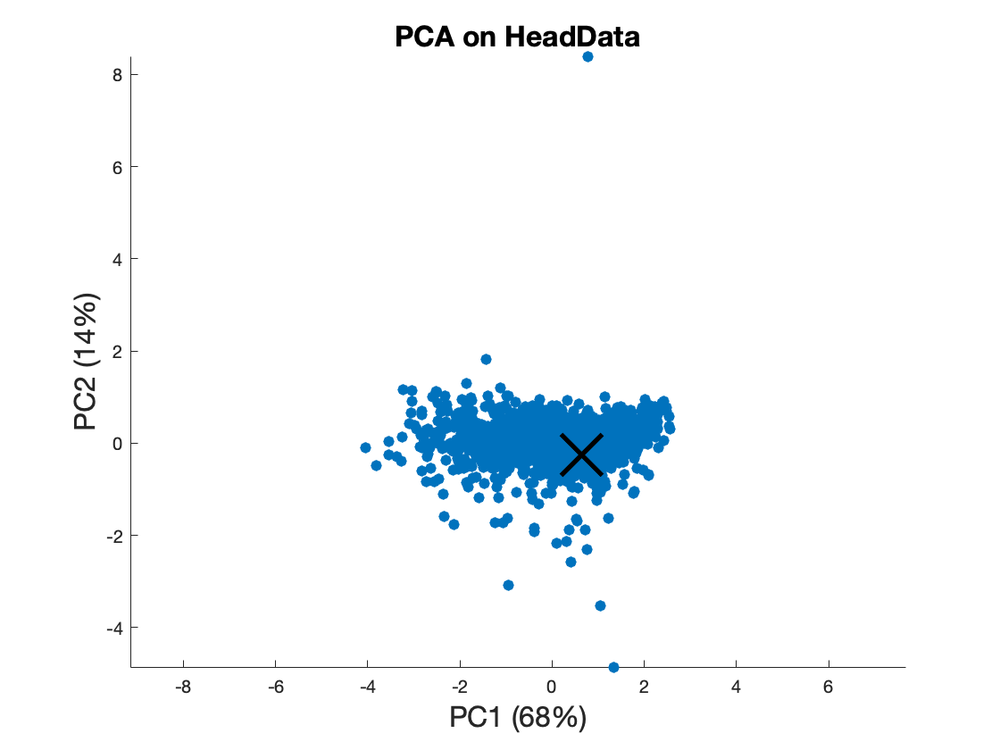
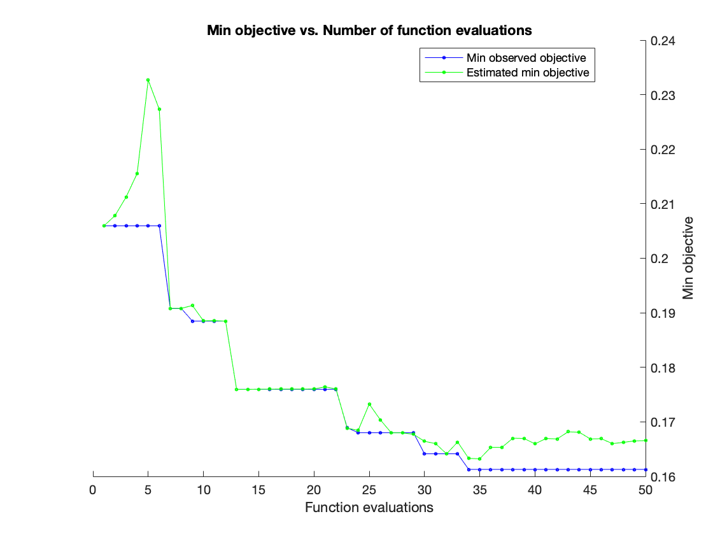
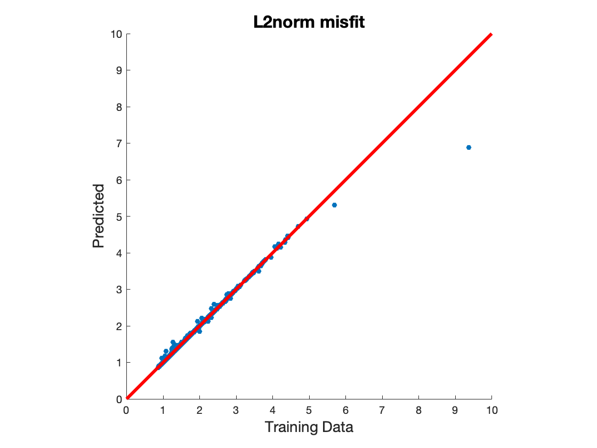
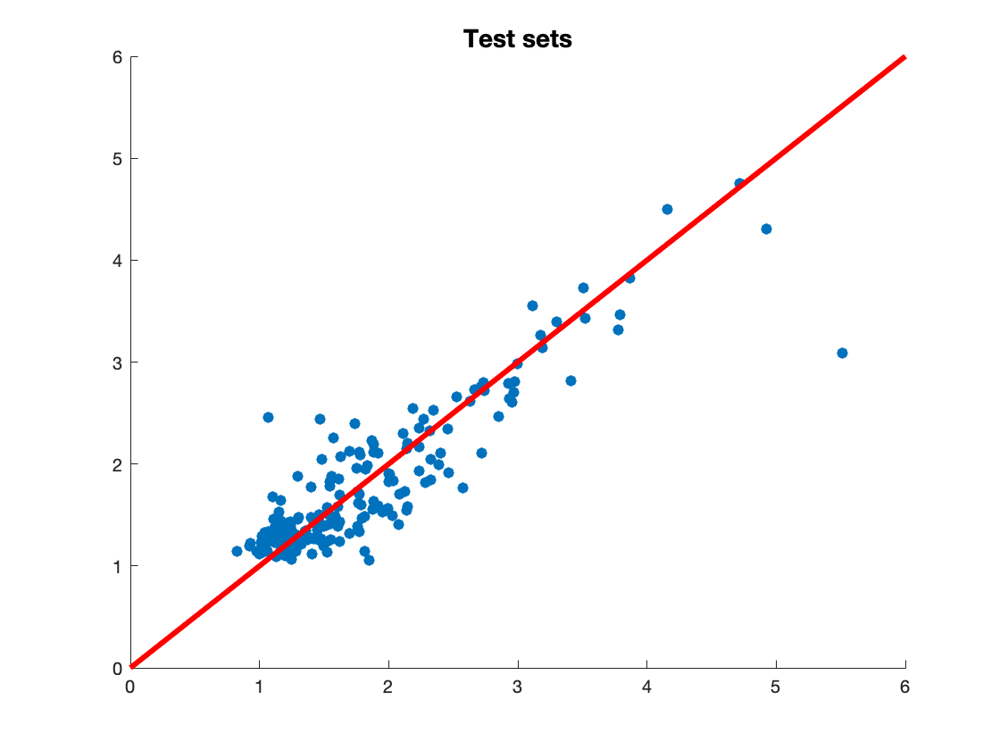

Author: Jihoon Park

# Summary

This notebook is to demonstrate model inversion with Danish groundwater management. 


```matlab
clear all; close all;
imatlab_export_fig('print-png')  % Static png figures.
```

# Load data


```matlab
addpath('./DanishCase_NewData'); % old data are in /DanishCase_old
load Parameters.mat; load Forecasts.mat; load Data.mat
ParametersNames={'ma','kh1','kh2','kh3',...
    'ch1','ch2','ch3','ch4','ch5','riv1'...
    ,'riv2','riv3','riv4','riv\_elev1','riv\_elev2','riv\_elev3',...
    'riv\_elev4','drn1','drn2','drn3','drn4','drn\_elev1','drn\_elev2',...
    'drn\_elev3','drn\_elev4','rch1','bud\_in'};


```

# Apply mixed PCA to data variables


```matlab
HeadDataOriginal=HeadData; % Copy the original data
Head=HeadDataOriginal(:,1:364); 
StreamFlow=HeadData(:,365:367);
[PCA1.coeff,PCA1.score,PCA1.EVs,~,PCA1.Explained]=pca(Head); PCA1.VarCumulative=cumsum(PCA1.Explained);
[PCA2.coeff,PCA2.score,PCA2.EVs,~,PCA2.Explained]=pca(StreamFlow); PCA2.VarCumulative=cumsum(PCA2.Explained);
PCA1.score=PCA1.score/sqrt(PCA1.EVs(1)); PCA2.score=PCA2.score/sqrt(PCA2.EVs(1));

Data_PC = [(PCA1.score),(PCA2.score)];
```

    Warning: Columns of X are linearly dependent to within machine precision.
    Using only the first 345 components to compute TSQUARED.
    > In pca>localTSquared (line 511)
      In pca (line 357)


```matlab
[PCAInfo.coeff, PCAInfo.score,PCAInfo.EVs,~,PCAInfo.Explained]=pca(Data_PC);
PCAInfo.VarCumulative=cumsum(PCAInfo.Explained);
PCAInfo.CutOff=.99;
PCAInfo.HowMany=find(PCAInfo.VarCumulative>(PCAInfo.CutOff*100)); 
PCAInfo.HowMany=PCAInfo.HowMany(1);

```

    Warning: Columns of X are linearly dependent to within machine precision.
    Using only the first 348 components to compute TSQUARED.
    > In pca>localTSquared (line 511)
      In pca (line 357)


Let's see first two PCs


```matlab
%% Visualize PCA Results.
DisplayPCAScores(PCAInfo.score,PCAInfo.Explained,'PCA on HeadData',40);
hold on; plot(PCAInfo.score(1,1),PCAInfo.score(1,2),'x','Color','k','Markersize',30,'LineWidth',3);
```





# Prepare training/test data

First set aside the reference


```matlab
Data.All.Idx.TruthRealization=1;
Data.All.NParams=length(ParametersNames);
% If outlier is not removed
[Data.All.N, Data.All.k]=size(Data_PC); % 995 x 367 saved here.

Data.All.Idx.AllbutTruth=setdiff(1:Data.All.N, Data.All.Idx.TruthRealization); % 
```

Split train/test dataset 


```matlab

Data.Train.Prop=.8; % 
Data.Train.N=round(length(Data.All.Idx.AllbutTruth)*Data.Train.Prop); % # of training examples.
Data.Test.N=length(Data.All.Idx.AllbutTruth)-Data.Train.N;
Data.Train.SplitSeed=11; rng(Data.Train.SplitSeed); % For reproducibility.

Data.Train.SampledIdx=randsample(1:length(Data.All.Idx.AllbutTruth),Data.Train.N); % This is the right sentence.
Data.Test.SampledIdx=setdiff(1:length(Data.All.Idx.AllbutTruth), Data.Train.SampledIdx);


Data.Train.X=ParamsValues(Data.Train.SampledIdx,:);
Data.Test.X=ParamsValues(Data.Test.SampledIdx,:);


Data.Train.Y_raw=PCAInfo.score(Data.Train.SampledIdx+1,1:PCAInfo.HowMany); 
Data.Test.Y_raw=PCAInfo.score(Data.Test.SampledIdx+1,1:PCAInfo.HowMany); 
Data.dobs=PCAInfo.score(Data.All.Idx.TruthRealization,1:PCAInfo.HowMany);

```

# Define y as L2 norm mismatch


```matlab
Data.Train.Y=Data.Train.Y_raw-repmat(Data.dobs,Data.Train.N,1);
Data.Test.Y=Data.Test.Y_raw-repmat(Data.dobs,Data.Test.N,1);

Data.Train.Y=sqrt(sum(Data.Train.Y.^2,2)); 
Data.Test.Y=sqrt(sum(Data.Test.Y.^2,2)); 

```

# Regression modeling by boosted regression trees

If `Optimize=1`, the following code runs Bayseian optimzation. If 0, it uses cross-validation to optimze the parameters. You can specify the parameters that you want to optimize in `fitrensemble` which is called by `FitRegressionTree_v2`, such as:

```matlab

fitrensemble(X,Y(:,k),...
            'CategoricalPredictors', CategoricalIndices_input,'Method',...
            'LSBoost','Learner',templateTree('Surrogate','on'),...
            'OptimizeHyperparameters',{'NumLearningCycles','MaxNumSplits','LearnRate'},...
            'HyperparameterOptimizationOptions',struct('Repartition',true, 'MaxObjectiveEvaluations',MaxIters,...
            'AcquisitionFunctionName','expected-improvement-plus','Kfold',5),'PredictorNames',ParamsNames);
``` 


As seen above, three tuning parameters are optimized, which are `NumLearningCycles` (number of trees in boosting),`MaxNumSplits`,`LearnRate`


```matlab
Data.RegResult=FitRegressionTree_v2(Data.Train.X,Data.Train.Y,ParametersNames,1,{'L2norm misfit'},50,1,1);
```

    |====================================================================================================================|
    | Iter | Eval   | Objective   | Objective   | BestSoFar   | BestSoFar   | NumLearningC-|    LearnRate | MaxNumSplits |
    |      | result |             | runtime     | (observed)  | (estim.)    | ycles        |              |              |
    |====================================================================================================================|
    |    1 | Best   |     0.20595 |      16.842 |     0.20595 |     0.20595 |          331 |       0.4439 |            4 |
    |    2 | Accept |     0.24187 |      1.1823 |     0.20595 |     0.20783 |           16 |       0.1229 |            4 |
    |    3 | Accept |     0.75978 |      1.5035 |     0.20595 |     0.21123 |           15 |     0.044417 |          355 |
    |    4 | Accept |     0.46942 |      7.1054 |     0.20595 |     0.21555 |          120 |    0.0091289 |           25 |
    |    5 | Accept |     0.27471 |      19.617 |     0.20595 |     0.23267 |          494 |      0.84691 |            5 |
    |    6 | Accept |      0.7258 |      11.854 |     0.20595 |     0.22731 |          491 |    0.0015932 |            1 |
    |    7 | Best   |     0.19078 |        16.6 |     0.19078 |     0.19082 |          498 |    0.0065142 |            3 |
    |    8 | Accept |     0.24448 |      72.121 |     0.19078 |     0.19081 |          487 |      0.84576 |           69 |
    |    9 | Best   |     0.18848 |       1.395 |     0.18848 |     0.19134 |           12 |      0.46691 |          102 |
    |   10 | Accept |     0.96212 |        13.6 |     0.18848 |     0.18852 |           95 |    0.0050274 |          389 |
    |   11 | Accept |     0.29293 |      19.144 |     0.18848 |     0.18855 |          490 |      0.99598 |            3 |
    |   12 | Accept |      1.0632 |      1.2075 |     0.18848 |     0.18847 |           26 |     0.015909 |            1 |
    |   13 | Best   |     0.17597 |       57.98 |     0.17597 |     0.17595 |          400 |     0.036327 |          515 |
    |   14 | Accept |      0.1858 |      8.0692 |     0.17597 |     0.17595 |           56 |      0.32965 |          764 |
    |   15 | Accept |      0.2097 |      12.019 |     0.17597 |       0.176 |          407 |     0.015218 |            1 |
    |   16 | Accept |      0.1773 |      27.473 |     0.17597 |       0.176 |          174 |      0.09601 |          790 |
    |   17 | Accept |     0.18919 |      71.273 |     0.17597 |     0.17601 |          489 |      0.13648 |          763 |
    |   18 | Accept |     0.21138 |     0.60304 |     0.17597 |     0.17601 |           23 |      0.26969 |            1 |
    |   19 | Accept |     0.24496 |      14.222 |     0.17597 |     0.17602 |          102 |      0.96775 |          788 |
    |   20 | Accept |      0.1942 |       1.049 |     0.17597 |     0.17602 |           10 |       0.2308 |          656 |
    |====================================================================================================================|
    | Iter | Eval   | Objective   | Objective   | BestSoFar   | BestSoFar   | NumLearningC-|    LearnRate | MaxNumSplits |
    |      | result |             | runtime     | (observed)  | (estim.)    | ycles        |              |              |
    |====================================================================================================================|
    |   21 | Accept |     0.18401 |      25.474 |     0.17597 |     0.17642 |          168 |      0.30273 |          786 |
    |   22 | Accept |     0.27839 |      1.2524 |     0.17597 |     0.17602 |           10 |      0.95326 |          793 |
    |   23 | Best   |     0.16893 |      25.354 |     0.16893 |     0.16885 |          195 |     0.032276 |          686 |
    |   24 | Best   |     0.16802 |      6.2218 |     0.16802 |     0.16844 |           50 |      0.14245 |          789 |
    |   25 | Accept |     0.16925 |      57.009 |     0.16802 |     0.17326 |          496 |    0.0098685 |          787 |
    |   26 | Accept |     0.17398 |      32.285 |     0.16802 |     0.17039 |          235 |     0.052962 |          365 |
    |   27 | Accept |     0.16973 |      12.294 |     0.16802 |     0.16798 |           87 |      0.16302 |          626 |
    |   28 | Accept |     0.18875 |      73.638 |     0.16802 |     0.16799 |          496 |      0.32752 |          755 |
    |   29 | Accept |     0.17984 |       10.16 |     0.16802 |     0.16771 |           79 |     0.095251 |          670 |
    |   30 | Best   |     0.16414 |       3.208 |     0.16414 |     0.16644 |           28 |      0.17676 |          764 |
    |   31 | Accept |     0.16566 |      34.085 |     0.16414 |     0.16601 |          269 |      0.02967 |          688 |
    |   32 | Accept |     0.21185 |      31.614 |     0.16414 |     0.16414 |          221 |      0.59787 |          710 |
    |   33 | Accept |     0.20188 |       2.075 |     0.16414 |     0.16631 |           83 |       0.1166 |            1 |
    |   34 | Best   |     0.16128 |      3.1199 |     0.16128 |      0.1633 |           28 |      0.16825 |          781 |
    |   35 | Accept |     0.17299 |      33.009 |     0.16128 |     0.16323 |          228 |      0.17488 |          752 |
    |   36 | Accept |     0.17248 |      3.8676 |     0.16128 |     0.16534 |           34 |      0.16326 |          695 |
    |   37 | Accept |     0.17457 |      35.359 |     0.16128 |     0.16533 |          271 |     0.036815 |          754 |
    |   38 | Accept |     0.17754 |      2.2292 |     0.16128 |     0.16701 |           20 |      0.19181 |          773 |
    |   39 | Accept |     0.16601 |      29.709 |     0.16128 |     0.16695 |          247 |     0.023371 |          711 |
    |   40 | Accept |     0.17239 |      26.477 |     0.16128 |     0.16597 |          221 |     0.026938 |          706 |
    |====================================================================================================================|
    | Iter | Eval   | Objective   | Objective   | BestSoFar   | BestSoFar   | NumLearningC-|    LearnRate | MaxNumSplits |
    |      | result |             | runtime     | (observed)  | (estim.)    | ycles        |              |              |
    |====================================================================================================================|
    |   41 | Accept |     0.17366 |      65.048 |     0.16128 |     0.16694 |          499 |     0.016734 |          515 |
    |   42 | Accept |     0.17043 |      55.158 |     0.16128 |     0.16687 |          496 |    0.0085744 |          772 |
    |   43 | Accept |     0.17472 |      4.0135 |     0.16128 |     0.16818 |           36 |      0.15576 |          724 |
    |   44 | Accept |      0.1708 |       7.795 |     0.16128 |     0.16811 |           60 |      0.17497 |          764 |
    |   45 | Accept |     0.16563 |      31.862 |     0.16128 |     0.16687 |          270 |      0.02603 |          754 |
    |   46 | Accept |     0.21619 |      3.3356 |     0.16128 |     0.16691 |           27 |      0.60739 |          791 |
    |   47 | Accept |     0.16413 |      36.024 |     0.16128 |     0.16601 |          311 |     0.026446 |          785 |
    |   48 | Accept |     0.16996 |      35.812 |     0.16128 |     0.16624 |          309 |     0.024592 |          669 |
    |   49 | Accept |     0.17417 |      2.8512 |     0.16128 |     0.16651 |           27 |      0.23567 |          773 |
    |   50 | Accept |     0.18168 |      65.038 |     0.16128 |     0.16656 |          494 |     0.065588 |          758 |
    
    __________________________________________________________
    Optimization completed.
    MaxObjectiveEvaluations of 50 reached.
    Total function evaluations: 50
    Total elapsed time: 1174.5363 seconds.
    Total objective function evaluation time: 1130.2407
    
    Best observed feasible point:
        NumLearningCycles    LearnRate    MaxNumSplits
        _________________    _________    ____________
    
               28             0.16825         781     
    
    Observed objective function value = 0.16128
    Estimated objective function value = 0.16656
    Function evaluation time = 3.1199
    
    Best estimated feasible point (according to models):
        NumLearningCycles    LearnRate    MaxNumSplits
        _________________    _________    ____________
    
               270            0.02603         754     
    
    Estimated objective function value = 0.16656
    Estimated function evaluation time = 32.4015
    








# Check the accuracy in terms of test data


```matlab
%[Data]=TestSetAnalysis(Data,{'L2 norm'}, 1);

%%
Data.RegResult{1}.TestPredicted=predict(Data.RegResult{1}.RegModels, Data.Test.X);
DisplayAllCrossPlots(Data.Test.Y,Data.RegResult{1}.TestPredicted,{'Test sets'},1,40);
Data.RegResult{1}.TestRMSE=sqrt(mean((Data.Test.Y-Data.RegResult{1}.TestPredicted).^2));
Data.RegResult{1}.Corr=corr(Data.Test.Y,Data.RegResult{1}.TestPredicted);
```




